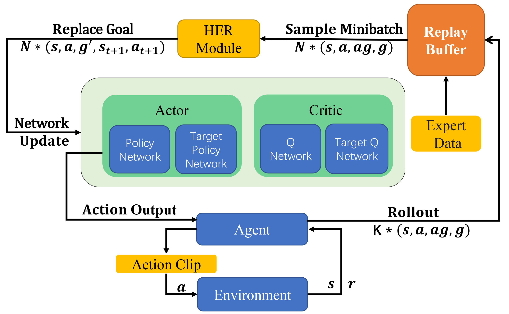
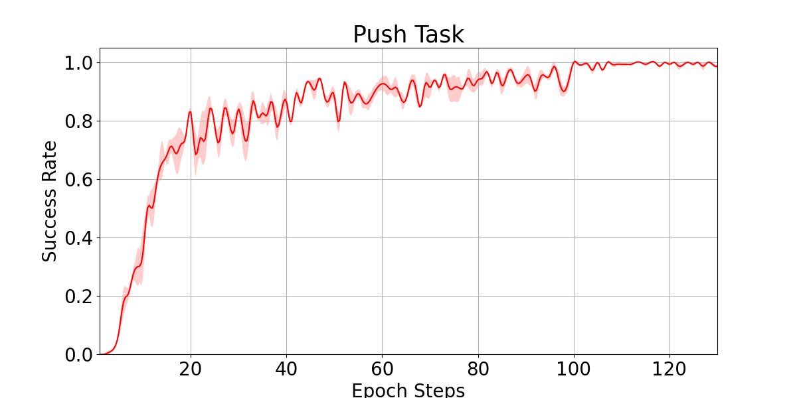
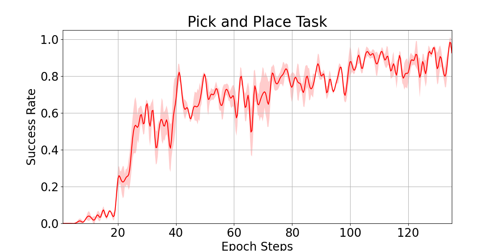

## I. Dependency：

```
gym v 0.18.0: openai RL lib
Mpi4py v 3.0.3：parallel computing  and download the offical MPI plug
      https://www.microsoft.com/en-    us/download/details.aspxid=57467)https://www.microsoft.com/en-us/download/details.aspx?id=57467)
torch v 1.8.1: Deep learning framework
pybullet   v 3.1.7: a physical simulation lib
numpy v1.19.2 
```


## II. Quick Start

This is a RL project for a humanoid arm environment under sparse reward.

```
├── URDF_model          # The robotic and cubes model
|── bmirobot_env        # robotic arm environment using pybullet lib
|   ├── bmirobot.py     # base env
|   ├── bmirobot_env_pickandplace_v2.py #pick and place task
|   ├── bmirobot_env_push_F.py          #Push task
|   ├── bmirobot_inverse_kinematics.py  #arm IK module
|   └── bmirobot_joints_info_pybullet.txt #arm joint and link information
|   └── bmirobot_pickandplace_v2.py #configuration pick and place task
|   └── bmirobot_push.py            #configuration push task
├── arguments                       #train arguments
├── bmirobot_1000_pick_demo.npz     #1000 expert data for pick task
├── bmirobot_1000_push_demo.npz     #1000 expert data for push task
├── ddpg_agent.py                   #DDPG algorithm code
├── demo_push.py                    #load the training model actor and performs
├── get_demo_data_pick.py           #get the expert data for pick and place task by using a programmed trajectory
├── get_demo_data_push.py           #get the expert data for push task by using a programmed trajectory
├── her.py                          #Hindsight experience replay algorithm
├── models.py                       #actor and critic model
├── normalizer.py                   #data normalize
├── train.py                        #train agent
├── utils.py                        #common functions
```

use `train.py` to train the agent 

and adjust the arguments in `arguments.py`

```python
class Args:
    def __init__(self):
        self.n_epochs = 200  # epoch num
        self.n_cycles = 50   # one epoch cycle time : 1 epoch: n_cycles*num_rollouts_per_mpi
        self.n_batches = 40  # updating network batches
        self.save_interval = 5
        self.seed = 125  # random seed
        self.num_workers = 19  # no use
        self.replay_strategy = 'future' #futrue sampling for HER algorithm
        self.clip_return = 50   
        self.save_dir = 'saved_models/' # save model path
        self.noise_eps = 0.01           # action selection noise
        self.random_eps = 0.3           # random action selection
        self.buffer_size = 1e6*1/2      # replay buffer size
        self.replay_k = 4  # replay with k random states which come from the same episode as the transition being replayed and were observed after it
        self.clip_obs = 200             #obs=clip(obs,max,min)
        self.batch_size = 256
        self.gamma = 0.98               #discount rate
        self.action_l2 = 1
        self.lr_actor = 0.001   #learing rate
        self.lr_critic = 0.001
        self.polyak = 0.95  # soft learning rate
        self.n_test_rollouts = 25 #testing time in a epoch model training
        self.clip_range = 5
        self.demo_length = 25 
        self.cuda = False # use cuda
        self.num_rollouts_per_mpi = 2 # 1 epoch: n_cycles*num_rollouts_per_mpi
        self.add_demo = True  # add expert data or not
        self.demo_name="bmirobot_1000_push_demo.npz"  #add expert data for push task, if pick, using pick expert data
        #self.demo_name="bmirobot_1000_pick_demo.npz"
        self.train_type = "push" #or "pick"
        self.Use_GUI =True  #GUI is for visualizing the training process
        self.env_name = 'bmirobot_'+str(self.train_type)+" seed"+str( self.seed ) #env_save_path_name
```

## III algorithm

DDPG + HER + Expert Data + action clip 


## IV. Result


<center>push task</center>


<center>pick and place task</center>





